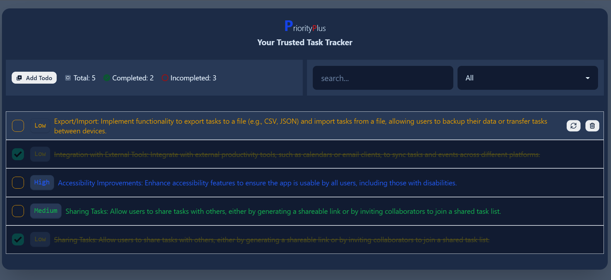

<a name="readme-top"></a>

<div align="center">
 <h3><b>PriorityPlus</b></h3>
</div>

<div align="center">

</div>

<!-- TABLE OF CONTENTS -->

# 📗 Table of Contents

- [📖 About the Project](#about-project)
  - [🛠 Built With](#built-with)
    - [Tech Stack](#tech-stack)
    - [Key Features](#key-features)
  - [🚀 Live Demo](#live-demo)
- [💻 Getting Started](#getting-started)
  - [Setup](#setup)
  - [Prerequisites](#prerequisites)
  - [Install](#install)
  - [Usage](#usage)
  - [Run tests](#run-tests)
  - [Deployment](#triangular_flag_on_post-deployment)
- [👥 Authors](#authors)
- [🔭 Future Features](#future-features)
- [🤝 Contributing](#contributing)
- [⭐️ Show your support](#support)
- [🙏 Acknowledgements](#acknowledgements)
- [📝 License](#license)

<!-- PROJECT DESCRIPTION -->

## 📖 PriorityPlus <a name="about-project"></a>

PriorityPlus is a simple task management application that helps you organize your tasks based on priority levels and completion status.

<!-- Features -->

## Key Features <a name="key-features"></a>

- Add Tasks: Easily add new tasks to your list.
- Edit Tasks: Modify the details of existing tasks, such as the task text and priority level.
- Remove Tasks: Delete tasks that are no longer needed.
- Toggle Completion: Mark tasks as completed or incomplete.
- Filtering: Filter tasks based on completion status and priority level.
- Search: Search for specific tasks using keywords.

<p align="right">(<a href="#readme-top">back to top</a>)</p>

## 🛠 Built With <a name="built-with"></a>

## Tech Stack <a name="tech-stack"></a>

<details>
  <summary>Client</summary>
  <ul>
    <li>React</li>
    <li>Vite</li>
    <li>Redux RTK</li>
    <li>TypeScript</li>
    <li>Tailwind</li>
    <li>And Some Libraries(you can find them at package.json file)</li>
  </ul>
</details>
<details>
  <summary>Server</summary>
  <ul>
    <li><a href=#>Hosted on Vercel</a></li>
  </ul>
</details>

<details>
<summary>Database</summary>
  <ul>
     <li>It doesn't use a traditional database. Instead, it utilizes the LocalStorage API for data storage.</li>
  </ul>
</details>

<!-- LIVE DEMO -->

## 🚀 Live Demo <a name="live-demo"></a>

- [Live Demo Link](https://priority-plus.vercel.app/)

<p align="right">(<a href="#readme-top">back to top</a>)</p>

<!-- GETTING STARTED -->

## 💻 Getting Started <a name="getting-started"></a>

To get a local copy up and running, follow these steps.

## Prerequisites <a name="prerequisites"></a>

- In order to run this project you need:

### It would be best if you had some familiarity with `HTML`, `CSS`,`TS`, `React` and `Tailwindcss`.

- A Computer (MAC or PC)
- code editor (VSCode,Atom etc...)
- A browser (Chrome,Mozilla,Safari etc...)
- Version Control System (Git and Github)

# Setup <a name="setup"></a>

Clone this repository to your desired folder:

```bash
       git clone https://github.com/AbdusSattar-70/PriorityPlus.git
       cd PriorityPlus
```

# Install <a name="install"></a>

Install this project with:

```bash
     npm install
```

# Run the app <a name="run-the-app"></a>

```bash
   npm run dev
```

# Deployment <a name="triangular_flag_on_post-deployment"></a>

You can deploy this project using:

- Render, Vercel, or GitHub pages

```bash
   npm install
   npm run build
```

<p align="right">(<a href="#readme-top">back to top</a>)</p>

<!-- AUTHORS -->

## 👥 Authors <a name="authors"></a>

## 👤 Abdus Sattar

- GitHub: [AbdusSattar-70](https://github.com/AbdusSattar-70)
- Twitter: [Abdus Sattar](https://twitter.com/Abdus_Sattar70)
- LinkedIn: [Abdus Sattar](https://www.linkedin.com/in/abdus-sattar-a41a26215/)

<p align="right">(<a href="#readme-top">back to top</a>)</p>

<!-- FUTURE FEATURES -->

## 🔭 Future Features <a name="future-features"></a>

- **Improve web accessibility feature for all users**
- **Add Multilingual feature**
- **Implement Drag and Drop: Allow users to rearrange the order of tasks by dragging and dropping them within the list.**

<p align="right">(<a href="#readme-top">back to top</a>)</p>

<!-- CONTRIBUTING -->

## 🤝 Contributing <a name="contributing"></a>

Everybody is welcome to suggest, changes,Contributions, issues, and feature request in this project.

In order to do it, fork this repository, create a new branch and open a Pull Request from your branch.

Feel free to check the [issues page](../../issues/).

<p align="right">(<a href="#readme-top">back to top</a>)</p>

<!-- SUPPORT -->

## ⭐️ Show your support <a name="support"></a>

If you like this project, Please give me ⭐️ and you can use it following [MIT](./LICENSE) license.

<p align="right">(<a href="#readme-top">back to top</a>)</p>

<!-- ACKNOWLEDGEMENTS -->

## 🙏 Acknowledgments <a name="acknowledgements"></a>

This project was created as part of a learning exercise.
Special thanks 💖 to React and Redux Toolkit for providing powerful tools for building web applications.

<p align="right">(<a href="#readme-top">back to top</a>)</p>

<!-- LICENSE -->

## 📝 License <a name="license"></a>

This project is under [MIT](./LICENSE) licensed.

<p align="right">(<a href="#readme-top">back to top</a>)</p>
